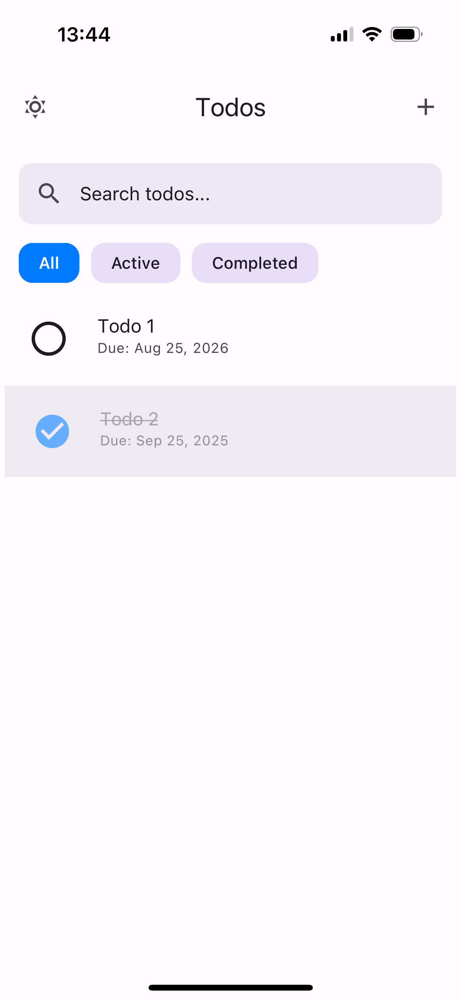
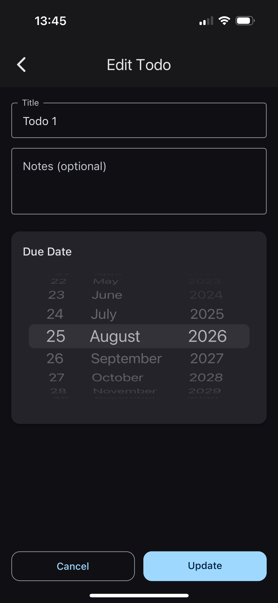
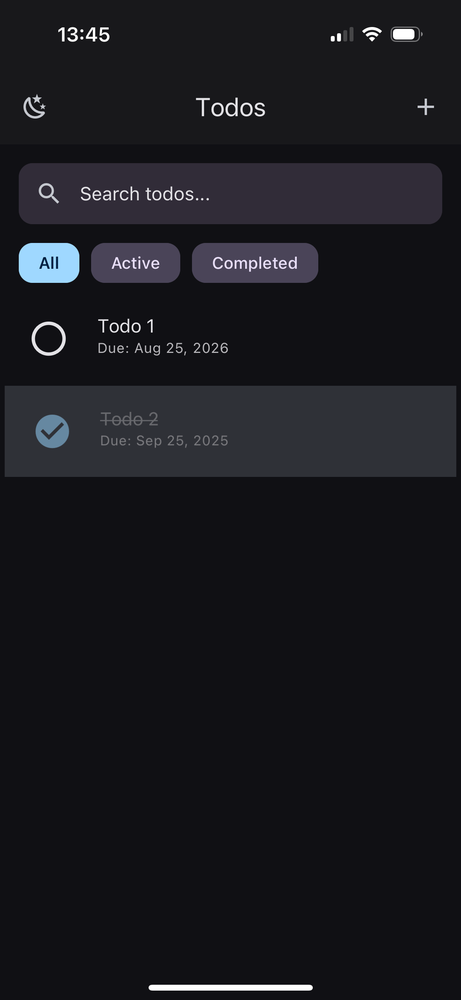

# Todo App - React Native & Expo

A production-quality React Native Todo application built with Expo, TypeScript, and modern libraries. This project demonstrates clean architecture, type safety, and professional UX patterns perfect for portfolio showcases.

## 🎯 Features

### Core Functionality

- ✅ **CRUD Operations** - Add, edit, delete, and toggle todos
- 🔍 **Search & Filter** - Real-time search with All/Active/Completed filters
- 📅 **Due Dates** - Optional due dates with overdue indicators
- 📝 **Notes** - Optional notes for detailed task descriptions
- 💾 **Persistence** - AsyncStorage with debounced saves (300ms)

### User Experience

- 🌗 **Theme Toggle** - Light/Dark/System theme with persistence (accessible from home screen header)
- 👆 **Swipe to Delete** - Full swipe gesture OR tap trash icon for deletion
- ↩️ **Undo Functionality** - Delete todos with ability to undo via snackbar
- 🔄 **Pull to Refresh** - Manual refresh capability
- 🎨 **Visual Feedback** - Smooth animations when marking todos complete with scale/opacity effects
- 📱 **Responsive Design** - Works on iOS, Android, and web
- ♿ **Accessibility** - Enhanced checkbox visibility with custom icons for better UX
- 🎯 **Consistent Design** - Unified 12px border radius across all UI components

### Technical Features

- 🚀 **Performance** - FlatList optimization, memoization, stable handlers
- 🎨 **Material Design** - React Native Paper components
- 📊 **Smart Sorting** - Active first (newest), completed by completion date
- ⚡ **Type Safety** - Full TypeScript coverage
- 🛡️ **Validation** - Input validation with user feedback

## 📸 Screenshots

<!-- Add your app screenshots here -->





## 🛠️ Tech Stack

- **Framework**: Expo (~53.0)
- **Language**: TypeScript
- **UI Library**: React Native Paper (Material Design 3)
- **State Management**: Zustand
- **Navigation**: React Navigation 6 (Stack Navigator)
- **Storage**: AsyncStorage
- **Gestures**: React Native Gesture Handler
- **Date Handling**: date-fns
- **Date Picker**: @react-native-community/datetimepicker (spinner display)
- **Animations**: React Native Reanimated (~3.17.4)

## 📁 Project Structure

```
todo-app/
├── src/
│   ├── app/
│   │   ├── App.tsx                 # Main app component with providers
│   │   ├── navigation/
│   │   │   └── RootNavigator.tsx   # Stack navigation setup
│   │   └── theme/
│   │       └── theme.ts            # Theme configuration & store
│   ├── components/
│   │   ├── TodoItem.tsx            # Animated swipeable todo item with enhanced delete
│   │   ├── TodoEditor.tsx          # Add/edit todo form with themed date picker
│   │   ├── Header.tsx              # App header with left-positioned theme toggle
│   │   ├── SearchBar.tsx           # Themed search input with consistent radius
│   │   └── EmptyState.tsx          # Empty state illustrations
│   ├── screens/
│   │   ├── HomeScreen.tsx          # Main todo list with enhanced filters & theming
│   │   └── EditTodoScreen.tsx      # Add/edit todo screen with improved UX
│   ├── store/
│   │   └── useTodoStore.ts         # Zustand store with persistence
│   ├── storage/
│   │   └── todoStorage.ts          # AsyncStorage utilities with debouncing
│   ├── types/
│   │   └── todo.ts                 # TypeScript type definitions
│   └── utils/
│       ├── date.ts                 # Date formatting utilities
│       └── validators.ts           # Input validation helpers
├── assets/
│   ├── screenshots/                # Portfolio screenshots
│   ├── icon.png                   # App icon
│   ├── splash.png                 # Splash screen
│   └── adaptive-icon.png          # Android adaptive icon
├── app.json                       # Expo configuration
├── package.json                   # Dependencies & scripts
├── tsconfig.json                  # TypeScript configuration
├── babel.config.js               # Babel configuration
└── README.md                     # Project documentation
```

## 🚀 Quick Start

### Prerequisites

- Node.js (v16 or newer)
- Expo CLI installed globally

### Installation & Setup

```bash
# Clone the repository
git clone <your-repo-url>
cd todo-app

# Install dependencies
npm install

# Start development server
npx expo start

# Or use specific platform
npx expo start --ios
npx expo start --android
npx expo start --web
```

### Development Commands

```bash
# Linting & Formatting
npm run lint          # Run ESLint
npm run lint:fix      # Fix ESLint issues
npm run format        # Format with Prettier
npm run type-check    # TypeScript type checking

# Platform-specific builds
npm run ios           # iOS simulator
npm run android       # Android emulator
npm run web           # Web browser
```

## 🏗️ Architecture Overview

### State Management

The app uses **Zustand** for state management with automatic persistence:

- **Todo Store**: `useTodoStore` - manages todos, search query, filters, and sorting
- **Theme Store**: `useThemeStore` - handles Light/Dark/System theme modes
- **Persistence**: Debounced saves (300ms) to AsyncStorage for todos, immediate saves for theme
- **Computed Values**: `visibleTodos()` applies search, filter, and smart sorting

### Theme System

- **Multi-Mode Support**: Light/Dark/System with automatic system detection
- **React Native Paper Integration**: Custom themes with Material Design 3
- **Status Bar**: Dynamic styling that adapts to current theme
- **Persistence**: Theme preference automatically saved and restored

### Data Model

```typescript
interface Todo {
  id: string;
  title: string;
  notes?: string;
  dueDate?: string; // ISO string
  createdAt: string; // ISO string
  completedAt?: string; // ISO string
  completed: boolean;
}
```

### Performance Optimizations

- **FlatList**: Optimized rendering with proper key extraction and batch sizing
- **Memoization**: `React.memo` on TodoItem component with stable event handlers
- **Debouncing**: 300ms debounced saves to prevent excessive AsyncStorage I/O
- **Efficient Filtering**: Combined search/filter/sort pipeline in computed selector
- **Gesture Handling**: Optimized swipe-to-delete with both tap and full-swipe options
- **Smooth Animations**: React Native Reanimated for completion state changes

## 📱 Portfolio Tips

### Recording App Demos

1. **iOS Simulator**: Use QuickTime Screen Recording
2. **Android Emulator**: Use Android Studio's recording feature
3. **Web**: Use browser dev tools or screen recording software

### Screenshot Locations

- Create `/assets/screenshots/` directory
- Recommended screenshots:
  - `home.png` - Main screen with todos
  - `editor.png` - Add/edit todo screen
  - `dark-mode.png` - Dark theme showcase
  - `empty-state.png` - Empty state illustration

### Key Features to Highlight

- **Enhanced Gestures** - Demonstrate both tap-to-delete and full swipe-to-delete
- **Smooth Animations** - Show completion animations with scale/opacity effects
- **Improved Theming** - Showcase enhanced dark mode with better contrast
- **Visual Consistency** - Highlight unified 12px border radius design
- **Better UX** - Show improved checkbox visibility and filter chip styling
- **Date Picker** - Demonstrate spinner-style date picker with theme awareness
- **Cross-platform** - Screenshots from iOS, Android, and Web

## 🔧 Customization

### Adding New Features

1. **New Todo Fields**: Extend `Todo` interface in `types/todo.ts`
2. **Additional Screens**: Add to `RootNavigator.tsx`
3. **Custom Components**: Follow existing patterns in `/components`

### Styling

- **Theme Colors**: Modify themes in `theme.ts`
- **Component Styles**: Use StyleSheet.create() pattern
- **Global Styles**: Extend React Native Paper theme

### Storage

- **New Data Types**: Add utilities to `storage/`
- **Different Storage**: Replace AsyncStorage imports

## 📄 License

MIT License - feel free to use this project for your portfolio or learning purposes.

---

## 🎯 Development Notes

This project was built with portfolio presentation in mind:

- **Clean Architecture** - Separation of concerns with organized folder structure
- **Type Safety** - Full TypeScript coverage with strict mode enabled
- **Modern Patterns** - React hooks, functional components, Zustand state management
- **Professional UX** - Material Design 3, accessibility support, gesture handling
- **Performance Focus** - Optimized FlatList, memoization, debounced operations
- **Cross-platform** - iOS, Android, and Web support out of the box
- **Production Ready** - Error handling, validation, proper TypeScript types

### Implementation Highlights

- **Enhanced UI/UX**: Improved dark mode theming with better contrast and visibility
- **Visual Consistency**: Unified 12px border radius across search, filters, and form elements
- **Advanced Gestures**: Dual deletion methods - tap trash icon OR full swipe gesture
- **Smooth Animations**: React Native Reanimated integration for completion state transitions
- **Better Accessibility**: Custom checkbox icons with enhanced visibility in both themes
- **Theme Integration**: Left-positioned theme toggle in header with proper theming throughout
- **Improved Components**: Enhanced filter chips with clear selection states and better styling
- **Date Picker UX**: Spinner-style date picker with theme-aware colors and proper constraints
- **Smart Sorting**: Active todos first (newest), completed todos by completion date automatically reordered
- **Type-Safe Store**: Fully typed Zustand store with proper TypeScript inference and persistence

Perfect for demonstrating React Native expertise, TypeScript proficiency, modern state management, and mobile development best practices.
